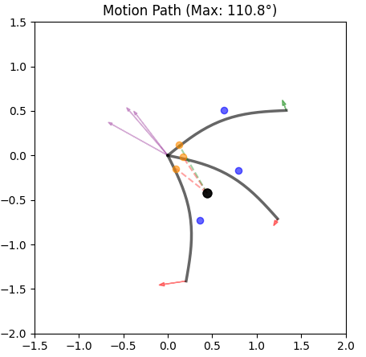
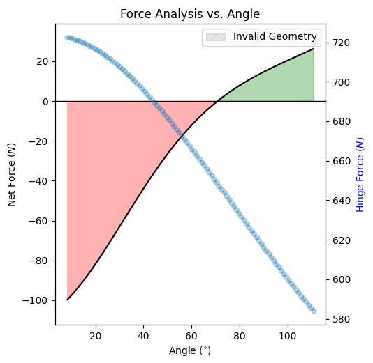

# PistonSimulation
## How to run
Run SimulationGraph to visualize a single config. You can change the config at the end of the file.  
Run Hybrid to run a search of optimal mount point on chassis and door for a piston

## Objective function

Both search uses the same scoring solution in EvaluationEngine.  
The GradientOptimizer also add penalty based on how much the result is invalid.

## Understanding the Motion Path Graph

* **Units:** All measurements are in meters.
* **Grey Curves:** Represent the door at three distinct angles: closed, halfway, and fully open.
* **Mounting Points:** The black dot indicates the piston’s chassis mounting point, while the yellow dot represents the anchor point on the door.
* **Center of Mass:** Indicated by the blue dot.
* **Hinge Forces:** The purple arrows at the pivot represent the forces applied to the hinge at each of the three door angles.
* **Net Force:** The arrow at the end of the door shows the net force acting on it. A green arrow indicates the door is opening, while a red arrow indicates it is closing.

## Understanding the Force Analysis Graph

This graph illustrates the net force acting on the door at every angle of its rotation.

* **Red Zones:** Indicate that the net force is negative, meaning the door will close automatically under its own weight or gas spring tension.
* **Green Zones:** Indicate that the net force is positive, meaning the door will open or remain open on its own.

### Finding the Equilibrium Point
The equilibrium angle can be identified at the precise point where the net force transition from red to green. At this specific degree, the forces are balanced, and the door will remain stationary without external assistance.

